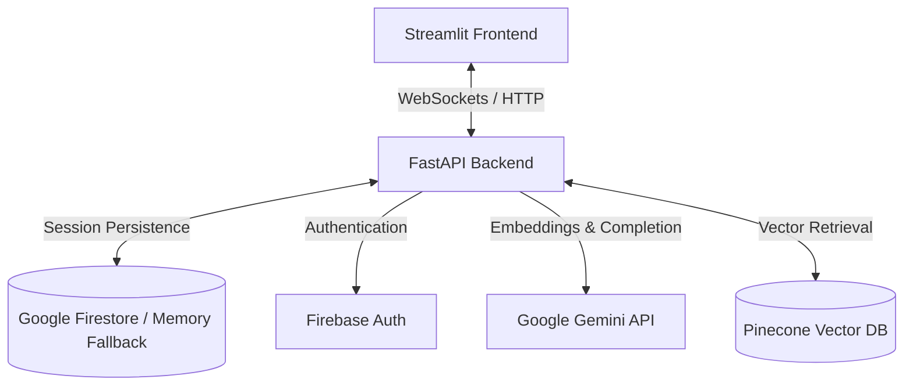

# Pingu AI

Pingu AI is an LLM-powered chat application that supports real-time streaming over WebSockets and session-isolated Retrieval-Augmented Generation (RAG). 

The system is built as a split-architecture codebase:
1. **Backend:** A FastAPI service handling chat sessions, document parsing, Pinecone vector indexing, and Gemini model interactions.
2. **Frontend:** A Streamlit dashboard utilizing custom CSS layouts and component-level files to coordinate session state, configuration inputs, and live socket streaming.

---

## System Architecture



### Core Features
* **Streaming Responses:** Real-time generation streaming powered by the `google-genai` SDK and the `gemini-2.5-flash-lite` model.
* **Session-Isolated RAG:** Document indexing (PDF, TXT, MD) using `gemini-embedding-001` (768 dimensions) stored under chat-specific Pinecone namespaces.
* **Hybrid Storage Layer:** Saves chat history and document metadata directly to Firestore, with a local in-memory fallback for offline development.
* **User Authentication:** Firebase ID token validation with a local developer bypass (`demo_token`).

---

## Directory Structure

```text
pingu-ai/
├── README.md               # System overview and setup (this file)
├── requirements.txt        # Shared dependencies
├── backend/                # FastAPI service
│   ├── README.md           # Backend routes, RAG processing, and architecture details
│   ├── .env                # Local backend environment secrets
│   ├── main.py             # Server entry point & CORS configuration
│   ├── config.py           # Configuration mapping and dynamic .env loading
│   ├── logger.py           # Multi-target logger (console & file)
│   ├── routes/             
│   │   ├── auth.py         # Auth validation dependency
│   │   └── chat.py         # REST chat endpoints and WebSocket stream loop
│   └── services/           
│       ├── chat_store.py   # Firestore / in-memory storage adapter
│       ├── firebase.py     # Firebase Admin SDK initializer
│       ├── llm.py          # Gemini API wrapper for stream generation
│       └── rag.py          # Pinecone vector indexing and PDF/text parsing pipeline
└── frontend/               # Streamlit application
    ├── README.md           # Component definitions, state sync, and custom styling
    ├── app.py              # Main dashboard entry point & layout definition
    ├── style.css           # Custom CSS overrides for Streamlit
    └── src/                
        ├── api.py          # API connector client (HTTP & WebSockets)
        ├── auth.py         # OAuth callbacks and credential storage
        ├── state.py        # Streamlit SessionState initialization & sync engine
        └── components/     # UI components
            ├── chat_view.py      # Core chat dialog & websocket message stream
            ├── login_view.py     # User authentication UI
            ├── settings_view.py  # Model controls & RAG file manager
            └── sidebar.py        # History thread list & deletion utility
```

---

## Environmental Setup

Create a `.env` file in the `backend/` directory. The frontend will automatically detect these values if loaded from the root or backend directories.

```env
# Gemini API Key
GEMINI_API_KEY="your-gemini-api-key"

# Firebase Client Configuration (Frontend Auth)
GOOGLE_CLIENT_ID="your-google-client-id"
GOOGLE_CLIENT_SECRET="your-google-client-secret"
FIREBASE_WEB_API_KEY="your-firebase-web-api-key"

# Firebase Admin SDK Configuration (Backend Persistence)
FIREBASE_SERVICE_ACCOUNT_JSON="pingu-52f3f-firebase-adminsdk-g8i1m-6f16c1d817.json"

# Pinecone Configuration (RAG)
PINECONE_API_KEY="your-pinecone-api-key"
PINECONE_INDEX_NAME="pingu-rag"
```

---

## Getting Started

### 1. Installation

Clone the repository and set up a virtual environment:

```bash
# Clone the repository
git clone https://github.com/aryanjha22/pingu-ai.git
cd pingu-ai

# Set up virtual environment
python3 -m venv .venv
source .venv/bin/activate

# Install dependencies
pip install -r requirements.txt
```

### 2. Run the Backend

Launch the FastAPI server on port `8000`:

```bash
uvicorn backend.main:app --host 0.0.0.0 --port 8000 --reload
```
* **API Docs:** Interactive Swagger UI is available at `http://localhost:8000/docs`.
* **Health Check:** `http://localhost:8000/health` returns standard status flags.

### 3. Run the Frontend

In a separate terminal shell (with the virtual environment active), run:

```bash
streamlit run frontend/app.py
```
The interface will be hosted locally at `http://localhost:8501`.

---

## Local Developer Bypass (Offline Sandbox)

To simplify local development, the codebase features graceful degradation for external dependencies:
* **No Firebase Credentials:** If `FIREBASE_SERVICE_ACCOUNT_JSON` is missing or invalid, the backend defaults to **Local Mode**, persisting chat sessions in-memory. Logging in on the frontend with the "Guest Login" button uses a mock profile (`demo_user`) backed by `demo_token` validation.
* **No Pinecone Credentials:** If `PINECONE_API_KEY` is not configured, vector database initializations are bypassed. Normal LLM chat remains active, but document upload and RAG indexing will be disabled.
