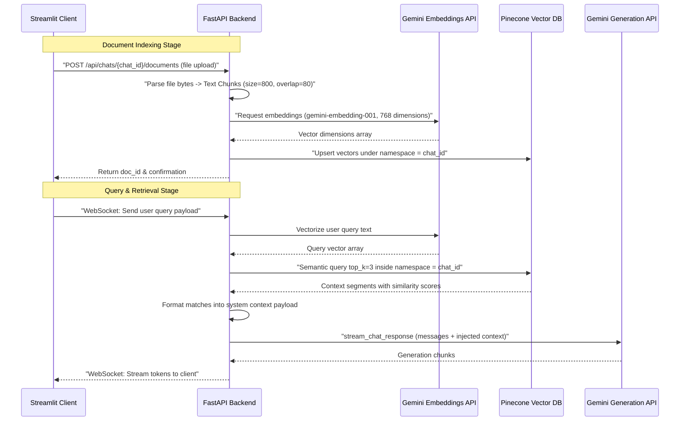

# Pingu AI Backend

The backend is a FastAPI application built to handle chat persistence, real-time message streaming via WebSockets, and document parsing for Retrieval-Augmented Generation (RAG).

---

## Technical Components

The backend architecture consists of:
1. **Web Layer (`main.py` & `routes/`):** FastAPI application wrapper containing CORS configurations and router registrations.
   * `auth.py`: Provides user authentication validation using Firebase token verification.
   * `chat.py`: Exposes REST endpoints for session metadata CRUD operations and hosts the bidirectional WebSocket route for live chat generation.
2. **Storage Layer (`services/chat_store.py`):** Instantiates a `ChatStore` provider. It saves chat history, settings, and uploaded document references. If Firebase configurations are absent, it shifts to an in-memory dictionary-backed fallback.
3. **LLM Engine (`services/llm.py`):** Interfaces with the `google-genai` SDK. Translates frontend message structures into Gemini payloads, configures temperature and system instructions (personas like "default" and "coder"), and handles streaming generators.
4. **RAG Engine (`services/rag.py`):** Manages vector indexes, parses files, and handles semantic chunk matching.
   * **Parsing:** Extracts text from uploaded PDF files (via `pypdf`) or plain text (TXT/MD).
   * **Chunking:** Splits document text into blocks of 800 characters with an 80-character overlap.
   * **Embeddings:** Generates 768-dimensional vectors using `gemini-embedding-001`.
   * **Vector Database:** Stores and queries vector chunks inside Pinecone using the `chat_id` as the namespace.

---

## API Documentation

### REST Endpoints

All REST APIs require a bearer JWT header (`Authorization: Bearer <token>`) except the `/health` endpoint.

| Method | Endpoint | Description |
| :--- | :--- | :--- |
| **GET** | `/health` | Unauthenticated application status check. |
| **GET** | `/api/chats` | Retrieves all chat history threads for the authenticated user, sorted by updated time (newest first). |
| **POST** | `/api/chats` | Registers a new chat session with specified metadata configurations. |
| **PUT** | `/api/chats/{chat_id}` | Updates chat parameters (such as name, persona, temperature, model) or saves message lists. |
| **DELETE** | `/api/chats/{chat_id}`| Deletes the session thread and flushes its corresponding namespace in Pinecone. |
| **POST** | `/api/chats/{chat_id}/documents` | Parses, chunks, embeds, and indexes a file into Pinecone for RAG. |
| **DELETE** | `/api/chats/{chat_id}/documents/{doc_id}` | Removes document vectors from Pinecone and deletes its db metadata. |

### WebSocket Protocol (`/api/ws/chat`)

Processes streaming conversation flows.

* **Authentication:** Expects the Firebase JWT token as a `token` query parameter. If Firebase is not configured locally, passing no token yields automated guest profile access (`demo_user`).
* **Client Request Frame (JSON):**
  ```json
  {
    "chat_id": "session-uuid",
    "messages": [
      {"role": "user", "content": "Query text"}
    ],
    "persona": "default",
    "temperature": 0.7,
    "model": "gemini-2.5-flash-lite"
  }
  ```
* **Server Response Protocol (JSON):**
  * **Text Stream Chunk:** `{"type": "chunk", "text": "partial word"}`
  * **Completion Signal:** `{"type": "done"}`
  * **Error Signal:** `{"type": "error", "text": "System exception message"}`

---

## RAG Flow



---

## Local Verification & Development

### 1. Key Dependencies
* `fastapi` and `uvicorn` for high-throughput serving.
* `websockets` for streaming connections.
* `google-genai` for model inference.
* `pinecone` for vector storage.
* `firebase-admin` for secure session controls.
* `pypdf` for text parsing.

### 2. Manual Diagnostics
Test backend server availability:
```bash
curl http://localhost:8000/health
```
Verify localized database operations without setting up Firebase (guest credentials bypass):
```bash
curl -H "Authorization: Bearer demo_token" http://localhost:8000/api/chats
```
